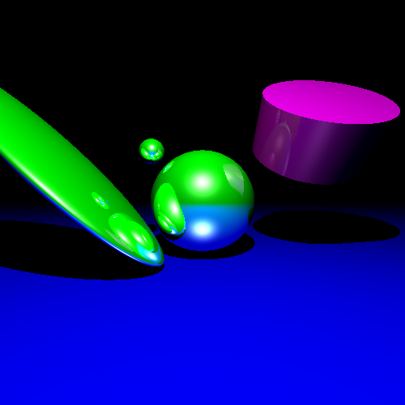
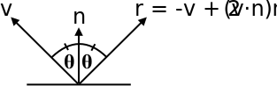

Computer Graphics - Homework Assignment 3 - Raytracing
======================================================

Overview:
---------

In this assignment, you will be implementing a ray tracer which supports
Phong lighting, shadows, reflections, and optionally refractions. You
will be able to create stunning artwork like
this:

The assignment is broken down into parts: (1) computing accurate normals
for ray/shape intersections, (2) computing direct illumination (a local
Phong lighting model with ambient, diffuse, and specular lighting), (3)
computing global illumination effects (shadows, reflections, and,
optionally, refractions).

Goals:
------

* Understand how to calculate virtual illumination for a 3D scene.

* Gain experience deriving and implementing mathematical expressions for
geometric calculations.

* Become more familiar with a 3D math library (identical to one available
when programming for a GPU).

* Become more comfortable with C++.

Background:
-------

* Book (FoCG,4e): Chapter 10 *Surface Shading* and, for the bonus, Chapter 13.1 *Transparency and Refraction*, and Chapter 11 *Texture Mapping*.
* Video: "Lecture 5: Illumination", "Quadratic light attenuation with distance", "Lambert's Cosine Law on a Flat Earth", "Assignment 3: Raytracing", and "Lecture 6: Parameterization".

(FoCG,4e is *Fundamentals of Computer Graphics (4th edition)* by Steve Marschner and Peter Shirley.)

If you love this topic and want to go *beyond*, here are some free, online resources:

* The *Physically Based Rendering* book: <https://www.pbrt.org/>. It won an Academy Award!
* The *Ray Tracing in One Weekend* series: <https://raytracing.github.io/>.
* *smallpt: Global Illumination in 99 lines of C++*: <https://www.kevinbeason.com/smallpt/> There is a presentation on the site explaining it line by line.

Getting Started & Handing In:
-----------------------------

* This project builds off of your [raycasting](https://github.com/yig/graphics101-raycasting) homework. There is no new
code to download. You will augment your existing codebase to generate
*raytraced* output for the `.json` scenes.

* You will be fleshing out `Scene::rayColor()` to implement a Phong lighting
model with shadows, reflections, and (optionally) refractions. You will
also revisit `Shape::rayIntersect()` to fill out `Intersection.position` and
`.normal` if you did not already do so (and, for bonus, `Intersection.texCoord`).

* Add your code to `scene.cpp` and `shape.cpp`.

* Build and run and test that it is working correctly.

* Check your work with the [autograder](https://github.com/yig/graphics101-raytracing-autograder).

* All of the lighting code you write depends on computing correct normals in your shapes. You can visualize your normals by writing `return 0.5*( normalize(closestIntersection( ray ).normal) + 1.0 );` as the first line of `Scene::rayColor()` and comparing your output to the `*-normals.png` images in the `examples/` directory.

* Copy the latest autograder output (`.html` file and associated directory) into a new `output/` subdirectory.

* Create a `.json` scene yourself. It can be the one you made for your raycaster with updated materials or an entirely new scene. Copy it and a `.png` rendering of it into the `output/` subdirectory as well.

* You are encouraged to share blooper images you create while implementing the assignment on Piazza.

* Create a file named `Notes.txt` in the folder. Describe any known issues or extra features. Name people in the class who deserve a star for
helping you (not by giving your their code!).

* When done, run the the `cpack` command from inside your build directory
to generate an appropriate zip file of your `raycasting` project
(that is now actually a raytracer).
The zip file it creates, `raycasting.zip`, will include
the `output` subdirectory and your `Notes.txt` file.
It will ignore unneeded large and numerous directories
(e.g. `build`).
Upload your `raycasting.zip` before the deadline.

* The framework and glm vector math library still provide all the support
code that you need.

* **THIS IS AN INDIVIDUAL, NOT A GROUP ASSIGNMENT. That means all code
written for this assignment should be original! Although you are
permitted to consult with each other while working on this assignment,
code that is substantially the same will be considered cheating.**

Rubric
------

* **(25 points)** The `Shape` subclasses' `rayIntersect()` methods should fill
out the `Intersection.position` and `.normal` fields. Both of these should
be in world-space. The position in world-space is easy to compute, since
it is the world-space ray's position + t * direction. The world-space
normal can be computed as the inverse transpose of the shape's
transformation matrix * the object-space normal. The object-space
normal can be computed as the gradient (vector of partial derivatives
with respect to *x,y,z*) of the implicit function for the part of
the shape intersected. **Note:** By convention, normals should point
away from the shape (towards its exterior, not its interior). For
example, the normal on the bottom face of the cylinder (the *z*=0 plane)
should be <0,0,-1>, not <0,0,1>. Because an implicit function
*F*(*x*,*y*,*z*) defines the shape as anywhere *F*(*x*,*y*,*z*) = 0,
both *F* and -*F* define the same shape. Their gradients point in the
opposite direction. The implicit functions given below---they are the
same as in Homework 2 - Raycasting---are defined properly so that their
gradients points towards the exterior.

    * **(5 points)** Sphere (centered at the origin with radius 1):

        * F(x,y,z) = x² + y² + z² - 1

    * **(5 points)** Plane (the *xy* plane, also known as the
*z* = 0 plane)

        * F(x,y,z) = z

    * **(5 points)** Cylinder (bottom at the origin, top at (0,0,1), radius 1)
with a top and bottom cap (circles with radius 1 at z=0 and z=1).
You handle this as a collection of three shapes with conditions:

        * if 0 < z < 1: F(x,y,z) = x² + y² - 1
        * if x² + y² < 1: F(x,y,z) = -z
        * if x² + y² < 1: F(x,y,z) = z-1

    * **(5 points)** Cone (bottom at the origin, top at (0,0,1), radius 1 at
the bottom, radius 0 at the top, with a bottom cap).
You handle this as a collection of two shapes with conditions:
    
        * if 0 < z ≤ 1: F(x,y,z) = x² + y² - (1 - z)²
        * if x² + y² < 1: F(x,y,z) = -z

    * **(5 points)** Cube (centered at the origin, with vertices
( ±1, ±1, ±1)). Think of it as six planes:

        * if -1 ≤ y,z ≤ 1: F(x,y,z) = x-1
        * if -1 ≤ y,z ≤ 1: F(x,y,z) = -(x+1)
        * if -1 ≤ x,z ≤ 1: F(x,y,z) = y-1
        * if -1 ≤ x,z ≤ 1: F(x,y,z) = -(y+1)
        * if -1 ≤ x,y ≤ 1: F(x,y,z) = z-1
        * if -1 ≤ x,y ≤ 1: F(x,y,z) = -(z+1)

    * **(bonus 5 points)** Mesh (arbitrary triangle meshes)

        * The normal should be perpendicular to whichever triangle is intersected.
By convention, the vertices of a triangle are given in counter-clockwise
order when viewed from the exterior of the triangle along the normal.
The normal can be obtained via the cross product.

* **(75 points)** Illumination. This code goes into `Scene::rayColor()` and
replaces the stub that you wrote that simply returns
`Intersection.diffuse_color`. The expression we will be using for the
color at a point on a surface is:

    ![K_R I_R + K_T I_T + \sum_L \big( K_A I_{AL} + \big[ K_D I_L ( N \cdot L ) + K_S I_L ( V \cdot R )^n  \big] S_L \big)](docs/illumination.png)
    
    In this expression, *KA*, *KD*, *KS*,
*n*, *KR*, and *KT*
refer to `Material.color_ambient`, `.color_diffuse`, `.color_specular`,
`.shininess`, `.color_reflect`, and `.color_refract`. The summation is over
all the `Light` structures in the `Scene`; *IAL* and *IL* refer to
`Light.color_ambient` and `.color`. You can multiply colors stored as
`vec3`'s, and it will do the right thing (multiply each channel or
wavelength of light). The other terms will be defined below.

    * For direct illumination, you will implement a local Phong lighting model
with ambient, diffuse, and specular terms.

        * **(10 points)** Ambient lighting: *KA IAL*

        * **(15 point)** Diffuse lighting: *KD IL ( N · L )*.
*N* is the (normalized) surface normal vector and *L* is the (normalized) vector
from the surface position to the light's position. Note that if this dot
product is negative, then the light is behind the surface and you should
not add diffuse **or** specular lighting.

        * **(15 points)** Specular lighting: KS IL ( V · R )n.
*V* is the (normalized) vector from the surface position to the "eye"
position. (Because you are writing a recursive ray tracer, the "eye" in
this formula should be the position of the ray parameter passed to `rayColor()`.)
*R* is the (normalized) direction from the light position to the surface
position, reflected across the surface normal. The formula for
reflecting a vector across another vector is given below under
**Implementation Details**. Note that if the dot product is negative, then
the light is reflected away from the viewer and you should not add any
specular lighting. (You can use max( 0, *V · R* ) instead
of an if statement if you desire.) Also note that if the dot product
used for diffuse lighting is zero (the light is behind the surface),
then you also should not add specular lighting.

    * For indirect or global illumination, you will add shadows, reflections,
and (optionally) refractions.

        * **(15 points)** Shadows. Is there an object between the surface position
and the light? If so, set *SL* to 0. Otherwise,
set *SL* to 1. You can check this easily
by calling `closestIntersection()` with a ray from
the surface position in the direction from the surface position towards
the light position. Check if there is an intersection closer than the
light itself. Note that if the ray originates from the surface position
exactly, your `closestIntersection()` method may find that the closest
intersection is still the surface position (t=0). To avoid this problem,
offset the ray's position by epsilon (a tiny number) along the ray's direction.

        * **(20 points)** Reflections. If `Material.reflective` is true, then
reflect the vector from the "eye" to the surface position across the
surface normal and call `rayColor()` recursively to find the color of
light *IR* seen by that ray. (Because you are writing
a recursive ray tracer, the "eye" in this formula should be the position
of the ray parameter to `rayColor()`.) The formula to reflect one vector
across another is below under **Implementation Details**. Just like with
shadow rays, you will want to offset the reflected ray's position along its
direction to avoid self-intersection. To keep light from reflecting
forever, only do this if `max_recursion > 0` and pass `max_recursion-1`
to `rayColor()`.

        * **(bonus 5 points)** Refraction. If `Material.refractive` is true, then
the object is translucent. Refract the vector from the eye to the
surface position into the surface according to the index of refraction
and call `rayColor()` recursively to find the color of light *IT* seen
by that ray. (The formula for the refracted direction can be found in
the book.) To keep light from bouncing forever, only do this if
`max_recursion > 0` and pass `max_recursion-1` to `rayColor()`.
To get this right, you will have to adjust your code elsewhere. You will
intersect with the inside of shapes. To detect this, check if the normal
faces towards or away from the ray. You will want to use a normal that
faces the ray direction when calculating lighting effects other than
refraction. The ratio of the index of refraction of air to the `Material`
is inverted when leaving versus entering a surface. Translucent objects
should cast less of a shadow. If the shadow ray hits a refractive
object, use the object's refractive color instead of a 0 or 1 for
*SL*.

* **(bonus 10 points)** Texture mapping. To do this you do two things. In
`Shape::rayIntersect()`, fill out `Intersection.texCoord` with explicit 2D
coordinates (numbers between 0 and 1) that parameterize the shape. In
`Scene::rayColor()`, if `material.use_diffuse_texture` is true, get the
texture from `Scene::textures[material.diffuse_texture]`, use
`Intersection.texCoord` to look up the color at that texture coordinate in
the image, and then multiply this color with
`material.diffuse_color` to use as the diffuse color *KD*.
If there is interest in this, I can provide additional guidance.
You will need to create a scene that uses textures (sets
`material.use_diffuse_texture` to true and `material.diffuse_texture` to e.g. `bricks`, and adds a `textures` property to the JSON scene,
e.g. `textures = { 'bricks': 'path/to/bricks.png' }`).
    
    * Cylinder and cone: The end cap texture coordinates should map the object-space xy-plane unit square [-1,1] to the texture coordinates' [0,1] square.
    
    * Plane: The plane should map the object-space xy-plane unit square [-1,1] to the texture coordinates' [0,1] square. The texture coordinates elsewhere should repeat modulo.
    
    * Cube: Each face should map to the texture coordinates' [0,1] square. The orientation does not matter.

The Code
--------

* The code for the raytracer is the same as the code for the raycaster.
All of your changes will be to `Shape::rayIntersect()` (to fill out
`Intersection.position` and `.normal`) and to `Scene::rayColor()`.

* The one exception is `Scene::render()`, where you should initially call
`rayColor()` with a `max_recursion` of whatever your code can handle. A
value of 3 is sufficient. Also note that the resulting `rayColor()` may be
very bright, with a value outside [0,1]. To clamp it to the valid
range, you can use the function `glm::clamp( color, 0.0, 1.0 )`.

* To iterate over the lights in `Scene::rayColor()`, you can use:

        for( const Light& l : lights ) { ... }

Implementation Details
----------------------

To reflect a (not necessarily normalized) vector **v** across a
normalized vector **n**, the formula for the reflected vector **r** is
**r = v - 2(v·n)n**.

glm and C/C++ standard library functions you need for this assignment
---------------------------------------------------------------------

**glm.** Please consult the Raycasting handout for the basics of
**glm**. The code particular to raytracing will make use of `transpose(m)`
and perhaps `clamp(v, minVal, maxVal)` and `reflect(v,n)`.

**std::max(a,b)**. This is part of C++'s `<algorithm>`. Note that
`std::max()` requires both parameters to have the exact same type. If not,
you will get a very long compiler error since they are generic functions
written using C++ templates. You can also use `glm::max(a,b)`.
